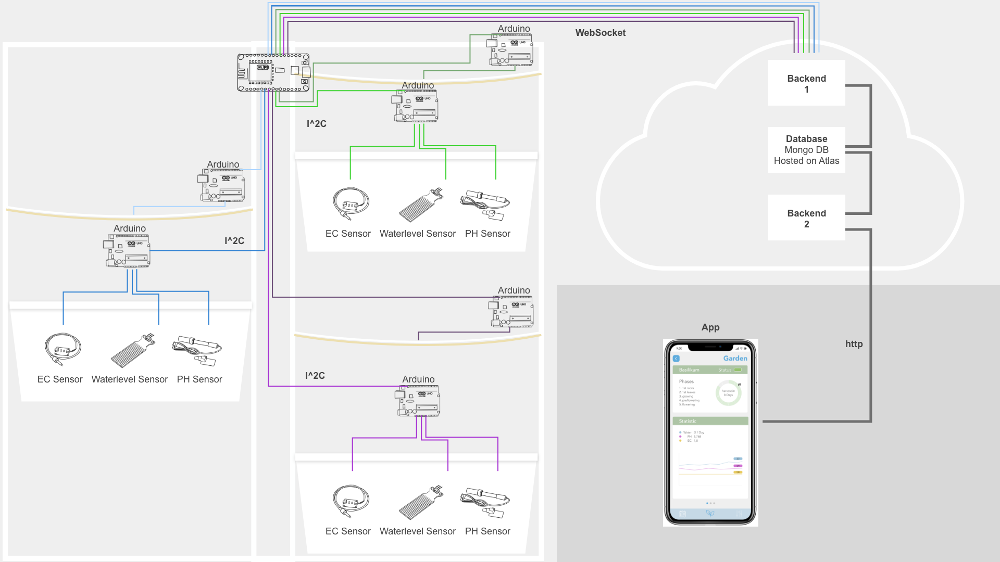

# plantarium

In unserem Projekt haben wir, innerhalb unseres Semesters an der Hochschule für Gestaltung Schwäbisch Gmünd, ein automatisiertes Hydroponisches Bewässerungssystem mit App entwickelt. Mit diesem System kann man Pflanzen schneller großziehen und die richtigen Nährstoffe für die Pflanzen dosieren.

Der Stack besteht aus: </br>
der mit Vue.js umgesetzten **App**, </br>
einem [Backend 2](https://github.com/maxicozy/plantarium-backend-ii), dass die Daten aus der Datenbank für die App bereitstellt, </br> 
einem [Backend 1](https://github.com/maxicozy/plantarium-backend-i), dass die Daten aus dem Hydroponischen System in die Datenbank einspeist </br>
und aus den [Nodes](https://github.com/maxicozy/plantarium-nodes) die Sensordaten sammeln und die Hardware kontrollieren. </br>

Unser Prjektteam besteht aus: </br>
[Noah Mantel](https://github.com/Nodarida) </br>
[Ligia Dietze](https://github.com/Ligiki1) </br>
[Maximilian Becht](https://github.com/maxicozy) </br>
[Marius Schairer](https://github.com/marius220699) </br>

## plantarium-app

Die App wird über das zweite Backend mit Daten aus der Datenbank versorgt. Über den Setup Prozess kann man seine Gärten, Module und Pflanzen konfigurieren und anschließend in Home und Kalender überwachen.




In der `App.vue` wird eine Navigationsleiste eingebunden, mit der man zwischen den Settings, dem Kalender und dem Home wechseln kann
Aktuell ist der 'Home'-Teil der App umgesetzt und wird bereits mit tatsächlichen Daten versorgt.

Dort wird entweder der `PlantHome.vue` oder der `PlantGarden.vue`-Screen gerendert. 

### PlantHome

In der PlantHome wird eine Economy-Card gerendert, auf der ein paar Daten über die Ökologischen Erparnisse des Nutzers gezeigt werden.
Aktuell noch hardgecodet, aber sobald unser System ein wenig länger läuft kann zur Ermittlung dieser Daten basierend auf Erfahrungswerten eine Formel aufgestellt werden

Darunter werden in einer Carousel-Component die `GardenCard`s gerendert, so kann man im Homescreen zwischen allen Gärten hin- und herswipen. 

In der Headbar der `GardenCard` wird der Titel des Gartens angezeigt, darunter die Füllstände des Düngermoduls mit der `Level.vue` - Component und anschließend, das tatsächliche System repräsentierend angeordnet, die Module mithilfe der `Module.vue`. Die ausgefüllten Module kann man antippen, welche einen auf die Detailseite `PlantGarden` weiterführen.

### PlantGarden

Auf der PlantGarden - Seite wird eine Carousel-Component dargestellt, in welcher man zwischen allen Modulen des vorher angetippten Gartens hin- und herswipen kann, das zunächst angezeigte Modul ist jedoch das zuvor ausgewählte. Mit einem Homebutton in der linken oberen Ecke, der in der `Homebutton.vue` definiert wird, kann man zurück zur `PlantHome.vue` wechseln.

Darunter wird die `ModuleCard.vue` gerendert. Der Header zeigt den Namen der Pflanze an, welche in diesem Modul angepflanzt ist und in der ModuleCard selbst werden links die Wachstumsphasen der Pflanze angezeigt welche in der templateData-Kollektion der Datenbank gespeichert sind. Rechts daneben befindet ist die `PieChart.vue` eingebunden, welche abhängig von den aus dem Backend 2 mitgesendeten Parametern `phases`, `percentGrown` und `harverstIn` anzeigt wie viel Zeit noch verbleibt bis die Pflanze geerntet werden kann und wie viele der Wachstumsphasen schon durchlaufen sind.

Darunter, ebenfalls in der Carousel-Component, zeigt die `StatisticCard.vue` Vuetify-Sparkline-Components an welche mit den SensorDaten aus der Datenbank versorgt werden.

Unter jeder Carousel wird die `Delimiter.vue` gerendert, welche indiziert wie viele Carousel-Einträge es gibt und welcher aktuell angezeigt wird.

## Projekt setup
```
npm install
```

### Kompiliert und hot-reloadet für Entwicklung
```
npm run serve
```

### Kompliliert für Produktion
```
npm run build
```

### Lintet und fixt Dateien
```
npm run lint
```

### Konfiguration anpassen
Siehe [Konfiguartionsreferenz](https://cli.vuejs.org/config/).
